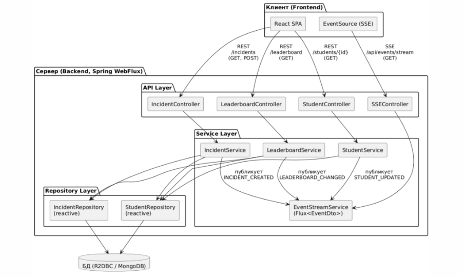

# Проект по предмету reactive java 

В рамках проекта разработано веб-приложение «HooliGuns of ITMO», предназначенное для регистрации нарушителей внутреннего порядка университета, фиксации проступков и ведения «доски позора». В отличие от традиционных дисциплинарных систем, данное приложение содержит элементы геймификации, что делает процесс вовлечения пользователей более живым и социальным.

## Функциональные требования
### Роли пользователей

- `Bessmertniy`: модерация контента, управление пользователями и настройками.
- `Преподаватель`: добавление инцидентов, просмотр рейтингов, участие в голосовании.
- `Студент`: просмотр инцидентов, участие в голосовании.
- `Гость`: просмотр страницы авторизации

### Работа с инцидентами

- Создание карточки инцидента с описанием, местом, временем и типом нарушения.
- Возможность прикрепления изображений, ссылок и других доказательств.
- Модерация сообщений и материалов.
- Реактивное обновление ленты при появлении новых событий.

### Геймификация и социальные функции

- Возможность ставить реакции: лайки, дизлайки
- Подсчёт очков хулиганства и их отображение в карточке студента.
- Формирование «доски позора» — рейтингов нарушителей по различным параметрам.
- Накопление «званий» и «ачивок» за активность.
- Система ставок и рейтинг по выйгрышам пользователей на результат инцидента.

### Карточка студента-нарушителя

- История всех зарегистрированных проступков.
- График активности и количество полученных реакций.
- Возможность подачи жалобы на некорректный контент.

### Поиск и фильтрация

- Поиск по ключевым словам.
- Фильтры: по факультету, группе, дате, типу нарушения, популярности.
- Сортировка по дате, рейтингу и количеству реакций.

## Архитектура

## Sequence diagram

